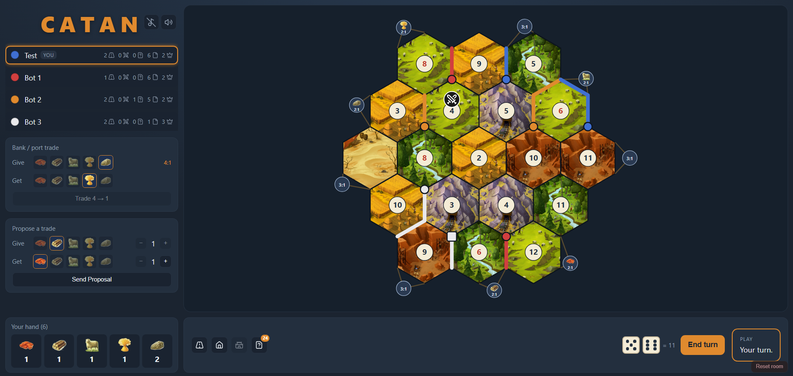

# Catan (web)

Real-time, server-authoritative base-game Catan for a small group of friends —
or for you plus a table of AI bots. Snake-draft setup, building, trading, the
robber, development cards, Longest Road & Largest Army, first to 10 VP wins, now
with turn pacing, piece pop-in animations, synthesized sound effects and BGM.



See [issues/0001-catan-web-game-v1.md](issues/0001-catan-web-game-v1.md) for the
original v1 spec and [issues/0015-catan-v2-ai-bot-players.md](issues/0015-catan-v2-ai-bot-players.md)
for the v2 bots epic.

## Monorepo layout

npm workspaces, three packages:

- **`shared/`** — pure game types, the pure rules engine `reduce(state, action) → { state, events }`,
  the per-player view projector `projectStateForPlayer`, the Socket.IO message protocol, and the
  pure bot brain `decideBotMove(view) → action`. This is the source of truth for game logic and is
  imported by both server and client.
- **`server/`** — Node + Socket.IO authoritative server holding the single in-memory room.
  Owns all RNG and re-validates every intent through `reduce`. Drives bot seats by feeding each
  bot's projected view through `decideBotMove` on a paced async loop.
- **`client/`** — Vite + React + Zustand app. Renders only from server snapshots; uses
  `shared` for UX affordances, never as an authority. Hosts the effect pipeline (animations,
  synthesized SFX, BGM) replayed from the server's narration events.

## Getting started

```bash
npm install            # installs all workspaces

npm test               # runs the shared rules unit tests (Vitest)

npm run dev            # starts the server (:3001) and client (:5173) together
# or run them separately:
npm run dev:server     # Socket.IO server on http://localhost:3001
npm run dev:client     # Vite client on http://localhost:5173
```

Then open `http://localhost:5173`.

### Testing multiplayer locally

A game needs **3–4 players**. Browser tabs share `localStorage`, so by default
every tab in one browser reclaims the same seat. To play several seats from one
browser, give each tab a distinct identity with the `?u=` query param:

- Tab 1 → `http://localhost:5173/?u=1` (first joiner = owner)
- Tab 2 → `http://localhost:5173/?u=2`
- Tab 3 → `http://localhost:5173/?u=3`

A **Reset room** button (bottom-right, dev-only) wipes the singleton room back to
an empty lobby for everyone — handy for re-testing without restarting the server.

### Playing with bots

Don't have three friends handy? From the lobby the owner can **add bot players**
to fill empty seats, then start the game. Bots take their own turns on a paced
loop — building, buying and playing development cards, bank/port trading, and
responding to trade offers — so you can play a full game solo or top up a short
table.

### Environment overrides

- Server: `PORT` (default `3001`), `CLIENT_ORIGIN` (default `http://localhost:5173`, for CORS).
- Client: `VITE_SERVER_URL` (default `http://localhost:3001`).

## Status

**v1 + v2 feature-complete** (all slices 0002–0026 landed). The shared rules and
bot engine are covered by 137 Vitest unit tests and the Socket.IO seat lifecycle
plus bot driver by 14 server-side integration tests — `npm test` runs both.

**v1 — base game**

| Issue | Slice | Done |
|-------|-------|------|
| 0002 | Walking skeleton — lobby & room lifecycle | ✅ |
| 0003 | Board topology graph + static SVG board | ✅ |
| 0004 | Setup phase — snake-draft placement | ✅ |
| 0005 | Roll → resource production → end turn | ✅ |
| 0006 | Building roads, settlements, cities + VP | ✅ |
| 0007 | Bank & port trading | ✅ |
| 0008 | Player-to-player trading | ✅ |
| 0009 | The 7 — discard, move robber, steal | ✅ |
| 0010 | Development cards | ✅ |
| 0011 | Longest Road bonus | ✅ |
| 0012 | Win condition & victory screen | ✅ |
| 0013 | Post-game replay & crown | ✅ |
| 0014 | Disconnection / reconnection seat lifecycle | ✅ |

**v2 — AI bots & polish**

| Issue | Slice | Done |
|-------|-------|------|
| 0016 | Bots in the lobby | ✅ |
| 0017 | Bot turn loop & server driver | ✅ |
| 0018 | Bot building & buying | ✅ |
| 0019 | Bot plays development cards | ✅ |
| 0020 | Bot responds to trades | ✅ |
| 0021 | Bot bank & port trading | ✅ |
| 0023 | Bot turn pacing — async server drive loop | ✅ |
| 0024 | Client effect pipeline + piece pop-in | ✅ |
| 0025 | Remaining animations — robber, dice, pulse, resource/steal | ✅ |
| 0026 | Synthesized game sounds + mute toggle, BGM | ✅ |

**Playable today:** a full game — lobby (fill empty seats with AI bots) →
snake-draft setup → roll/produce/end-turn → build roads/settlements/cities →
bank/port trades → player trades → the 7 (discard/robber/steal) → development
cards → Longest Road & Largest Army bonuses → first to 10 VP wins, with a victory
screen revealing every hand → the owner's "New game" reseats the group with the
winner crowned. All server-enforced with per-player snapshots and a narration
event log, paced with animations, synthesized sound effects and background music
(with a mute toggle).

**Seat lifecycle:** a player who drops mid-game is greyed but keeps their seat
(reclaimable via their session token); the table only blocks when it actually
needs that seat's input. After 2 minutes the seat goes *vacant* — claimable by
anyone (who inherits its full position) and auto-skipped so play continues.
The vacancy clock is tunable via the `VACANCY_MS` server env var.

Issues 0002 and 0003 are HITL: the architecture (reducer signature, projection
boundary, message protocol, client store) and the frozen board graph are meant to
be human-reviewed before downstream slices are trusted.
